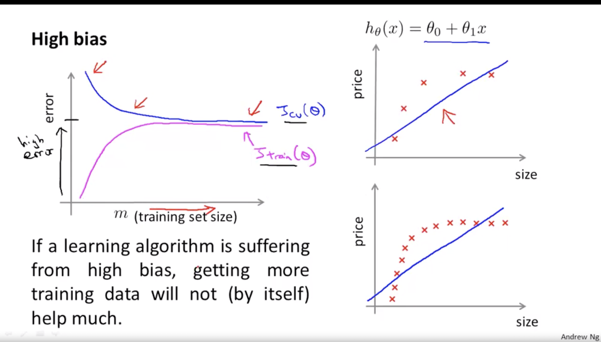
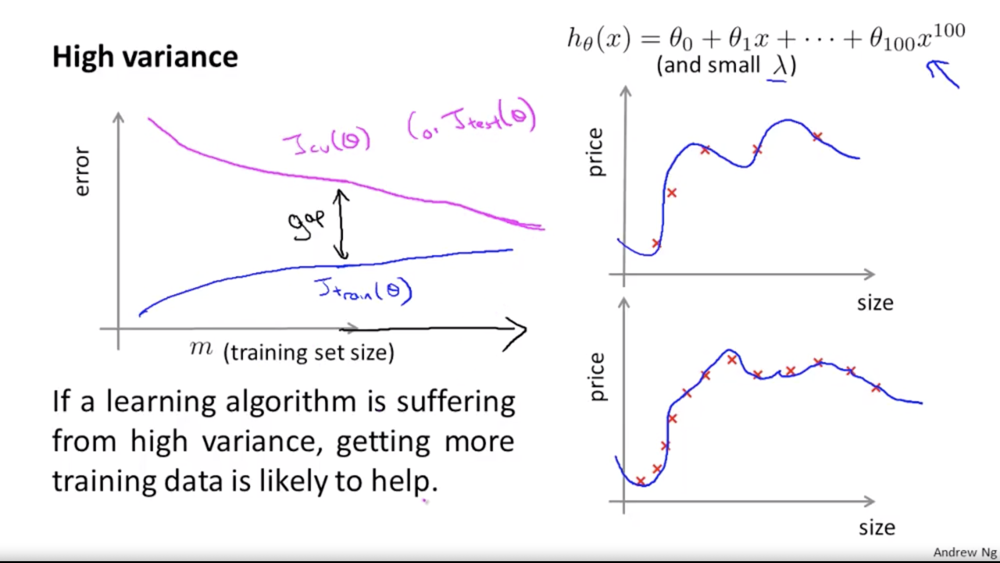

# Advice for Applying Machine Learning

## Evaluating a Learning Algorithm

### What to do next?

If you trained your model and the model is performing worse than you had expected you may want to try the following things:
* Get more training data (do not spend too much time as this does not always yield better results)
* Try smaller sets of features
* Try getting additional features
* Try adding polynomial features
* Try decreasing/increasing $\lambda$.

Do not randomly pick an option from the list above. Use a **machine learning diagnostic**: a test that you can run to gain insight in what is isn't working with a learning algorithm, and gain guidance as to how best improve its performance.

### Evaluating your hypothesis

A low training error does not necessarily mean a good hypothesis function. To prevent overfitting, split the data into a training set and test set. Usually 70% of the data is in the training set and 30% is in the test set.

### Model selection

$d$: Degree of polynomial

You may want to try out multiple values for $d$, $\lambda$, and so on. Then you choose the best values for $\Theta$ on a set that the model has not seen before. If you did this, however, on the test set you get a too optimistic accuracy. That's the reason we want to split our data into 3 sets: the training set (60%), the cross validation set (20%), the test set (20%). You use the training set for training, the cross validation set for model selection and the test set to obtain the accuracy.

The errors: 

Training error: $J_{train}(\theta) = \frac{1}{2m}\displaystyle\sum_{i = 0}^{m}(h_\theta(x^{(i)})-y^{(i)})^2$

Cross validation error: $J_{cv}(\theta) = \frac{1}{2m_{cv}}\displaystyle\sum_{i = 0}^{m_{cv}}(h_\theta(x_{cv}^{(i)})-y_{cv}^{(i)})^2$

Test error: $J_{cv}(\theta) = \frac{1}{2m_{test}}\displaystyle\sum_{i = 0}^{m_{test}}(h_\theta(x_{test}^{(i)})-y_{test}^{(i)})^2$

You want to choose the values for $d$ from $1, 2, …, 10$ and $\lambda$ in $0.00, 0.02, 0.04, …, 10$.

## Bias vs. Variance

High bias: underfitting. High variance: overfitting.

### Learning curves

### Deciding what to do next

- Get more training data (do not spend too much time as this does not always yield better results): fixes high variance
- Try smaller sets of features: fixes high variance
- Try getting additional features: fixes high bias
- Try adding polynomial features: fixes high bias
- Try decreasing $\lambda$:  fixes high bias
- increasing $\lambda$: fixes high variance

Small neural networks are more prone to overfitting but computationally cheaper. Large neural networks are more prone to overfitting and computationally more expensive. Use $\lambda$ to prevent overfitting.

## Building a spam filter

### Error analysis

- Start with a simple algorithm that you can implement quickly. Implement it and test it on your cross-validation data.
- Plot learning curves to decide if more data, more features, etc. are likely to help
- Error analysis: Manually examine the examples (in cross validation set) that your algorithm made errors on. See if you can spot any systematic trend in what type of examples it is making errors on.

Use numerical evaluation.

### Handling skewed data

|      | 1              | 0              |
| ---- | -------------- | -------------- |
| 1    | True positive  | False positive |
| 0    | False negative | True negative  |

$P = precision = \frac{True\ positives}{True\ positives+False\ positives}$

$R = recall = \frac{True\ positives}{True\ positives+False\ negatives}$

Trading off precision and recall: predict 1 if $h_\theta(x) \geqslant threshold$

Single method for rating the accuracy: $F_1 = 2\frac{PR}{P+R}$

## Using large datasets

Useful test: Given the input $x$, can a human expert confidently predict $y$.
